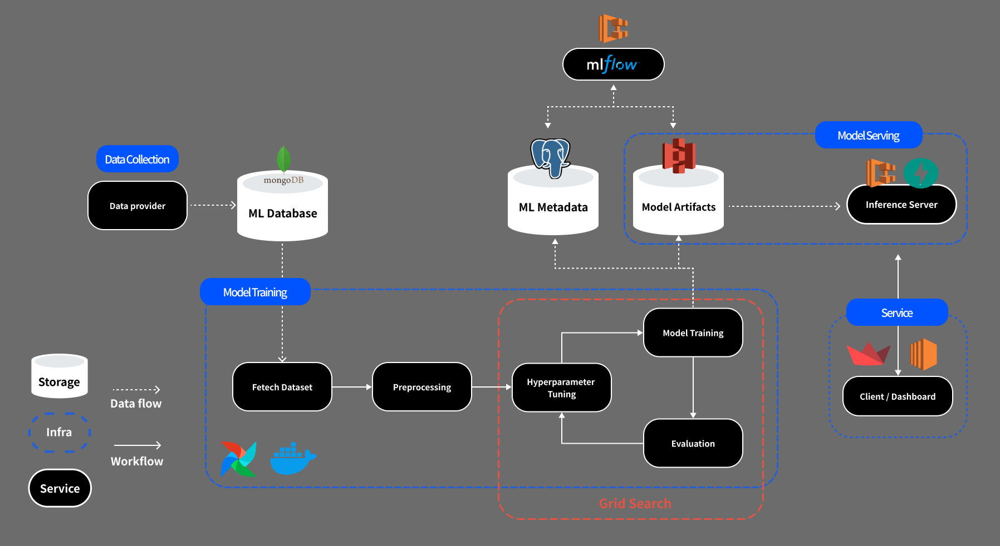
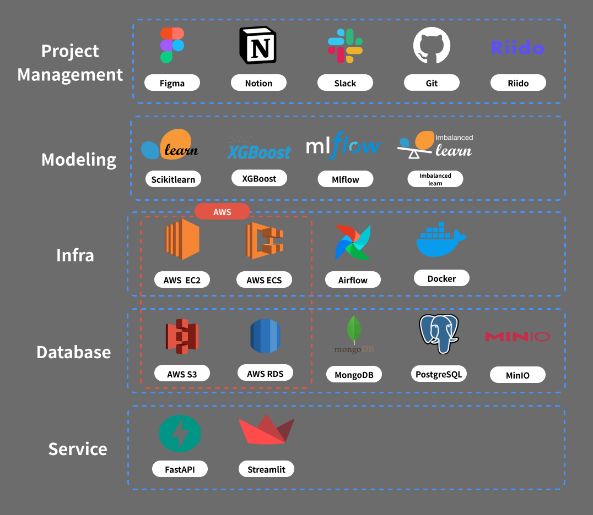

# HKToss-Project

HK Toss MLOps Project - **MLOps 를 활용한 대출 연체 예측 서비스 구축**



## Table of Contents

- [HKToss-Project](#hktoss-project)
  - [Table of Contents](#table-of-contents)
  - [1. Project Structure](#1-project-structure)
  - [2. Installation](#2-installation)
  - [3. Contribution](#3-contribution)
  - [4. Dataset](#4-dataset)
- [Appendix](#appendix)
  - [Tech Stack](#tech-stack)
  - [Authors](#authors)

## 1. Project Structure

이 프로젝트는 다음과 같은 5가지 컴포넌트로 구성되있습니다.

```
HKToss-Project/
│
├── airflow/        # Airflow DAG - automated model training & deployment
├── client/         # Streamlit - web dashboard service
├── inference_api/  # ML Inference Server
├── notebooks/      # Data Preprocessing(.ipynb) files, ML package test scripts
└── package/        # Python library for ML Model trainer + MLflow Logging

```

## 2. Installation

### 2.1. Prerequisites

-   환경변수 파일 `.env` 루트 폴더에 저장
-   `notebooks/01_data_prep.ipynb` 실행 전, 원본 데이터셋 다운로드

### 2.2. Run with Docker

#### 2.2.1. Airflow

    ```shell
    $ docker compose -f docker-compose.airflow.yml up
    ```

#### 2.2.2. Client / Inference API

-   client + API 실행

    ```shell
    $ docker compose --profile full -f docker-compose.yml up
    ```

-   client만, API 만 실행

    ```shell
    $ docker compose --profile client -f docker-compose.yml up
    $ docker compose --profile api -f docker-compose.yml up
    ```

-   _(각 서비스 폴더별 README 참고.)_

## 3. Contribution

### 3.1. 개발 환경 설정

1. Commit Message Template
    ```shell
    $ git config commit.template .gitmessage.txt
    ```
2. Python - Conda, Jupyter
    - [Anaconda3 설치](https://docs.anaconda.com/anaconda/install/windows/)
    - Jupyter Notebook 활용 개발 시 설치
    ```shell
    $ conda activate <VENV_NAME>
    $ pip install jupyter ipykernel
    ```
3. Docker
    - [Docker 설치](https://docs.docker.com/desktop/install/windows-install/)

### 3.2. 브랜치 규칙

-   `main` : 기본 브랜치입니다. 해당 브랜치로는 `push` 가 불가능합니다.
-   `dev` : 공용 개발 브랜치입니다. 해당 브랜치로 `Pull Request` 및 `Merge` 가 이루어집니다.
-   `feature/*_<이니셜>` : 기능 추가, 리팩토링 등 모든 개발 사항에 대해 사용되는 브랜치 이름입니다.
-   `hotfix/*_<이니셜>` : **버그 수정만** 실행할 때 사용되는 브랜치 이름입니다.
-   `release/*` : Release 전용 브랜치입니다. 해당 브랜치는 `Read Only` 입니다. (push 불가능)
-   `<이니셜>` : `feature, hotfix` 브랜치는 하나의 작업에 대해 매번 브랜치를 새로 생성해야 하며, 담당자는 브랜치당 1인입니다.
    -   담당자 구분을 위해 본인의 영어 이니셜 2자 (ex. Woojin -> WJ) 를 브랜치명 마지막에 포함합니다.
    -   `ex: feature/modeling_WJ`

### 3.3. 템플릿 사용하기

-   [커밋 메시지 템플릿 적용](#2-run-with-docker) : 처음 `git clone` 실행 후 한번만 실행
-   Pull Request, Issue, Commit Message 모두 템플릿 양식에 맞추어 작성합니다.

### 3.4. 이슈 공유 및 소통

-   이슈 작성은 **버그 공유** 를 위해 사용합니다.
-   `Bug Report` 항목으로 작성 및 템플릿 준수하여 작성합니다.

## 4. Dataset

이 프로젝트에서는 [**Kaggle - Home Credit Default Risk**](https://www.kaggle.com/competitions/home-credit-default-risk) 데이터셋을 사용하였습니다.

# Appendix

## Tech Stack



## Authors

-   김현빈 [id2046@naver.com](id2046@naver.com)
-   이나은 [happily2bus@gmail.com](happily2bus@gmail.com)
-   이현상 [dlgustkd980920@gmail.com](dlgustkd980920@gmail.com)
-   최우진 [cwwojin@gmail.com](cwwojin@gmail.com)
-   최호윤 [andychoi1997@naver.com](andychoi1997@naver.com)
